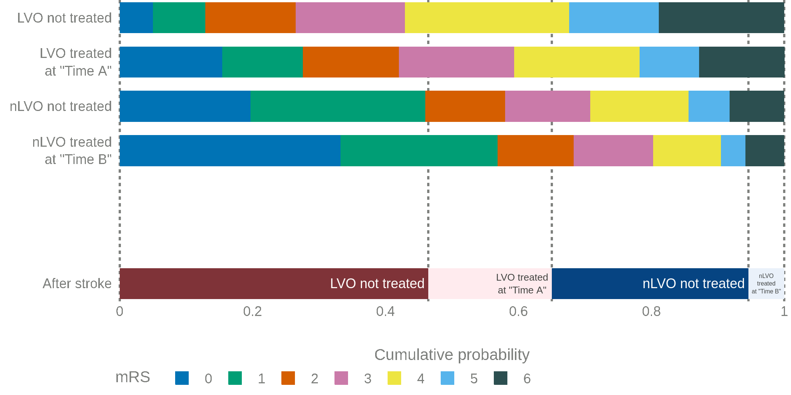

# Population stroke outcome model

A Streamlit app for predicting disability outcomes and utility after treatment of stroke with thrombolysis or thrombectomy. 

In this app we describe how we estimate the change in disability levels for a patient population if we know the time between when stroke symptoms began and when treatment was received.
The details behind the process are given in full in [this online book](https://samuel-book.github.io/stroke_outcome/intro.html).

Until now, modelling the outcome from stroke reperfusion treatment was a dichotomous affair, with a patient classified as either being disability free, or with stroke related disabilities. The method described here aims to provide a more granular disability outcome, describing the resulting disability as one of six levels (ranging from disability free, to death). 
The outcomes across all patients in the population are averaged to find a single value for the expected benefit of treatment. 

## Layout of the code

The `.py` file behind each page is kept as short as possible so that it is easier to change the layout of the displayed page.

Generally the necessary calculations are stored in functions in `outcome_utilities/`, and most of the formatting and displaying of objects is in the "container" scripts e.g. `outcome_utilities/container_X.py` (named for [Streamlit's way of grouping objects](https://docs.streamlit.io/library/api-reference/layout/st.container) but actually just `.py` scripts with all of the code needed to populate that chunk of the page).

### Which scripts do you need?

If you want to use the models but aren't interested in the Streamlit parts, you will need the following.

__Model__:

Rather than pulling out all of the functions from this repository, it will be easier to use the model provided in [the `stroke_outcome` repository](https://github.com/samuel-book/stroke_outcome):

+ The `clinical_outcome.py` model in `samuel-book/stroke_outcome/outcome_utilities` produces all of the results.

An example of using the model is [provided here](https://samuel-book.github.io/stroke_outcome/03_demo_of_outcome_model.html).

__Data__:

+ `outcome_data/mrs_dist_probs_bins.csv` - mRS probability distributions at fixed times for:
  + Pre-stroke
  + Treated at t=0
  + Treated at time of no-effect
  + Not treated 
+ `outcome_data/mrs_dist_probs_cumsum.csv` - mRS cumulative probability distributions for the same data as before.

### Pages 

The Streamlit landing page is `1: Introduction.py`. In the sidebar there are a series of other pages to choose, and these are stored in the `pages/` directory:

+ `2: Interactive_demo.py` - the main page. The user can select the treatment times and see the expected outcomes for the patient population.
+ `3: Advanced_options.py` - currently empty.
+ `4: Project.py` - information about the project and people behind this project.
+ `5: Cite_this_work.py` - Zenodo citation. 
+ `6: Resources.py` - links to further useful materials. 

The page topics follow the recommendations of Tom Monks and Alison Harper (in Proceedings of the Operational Research Society Simulation Workshop 2023 (SW23)). 
